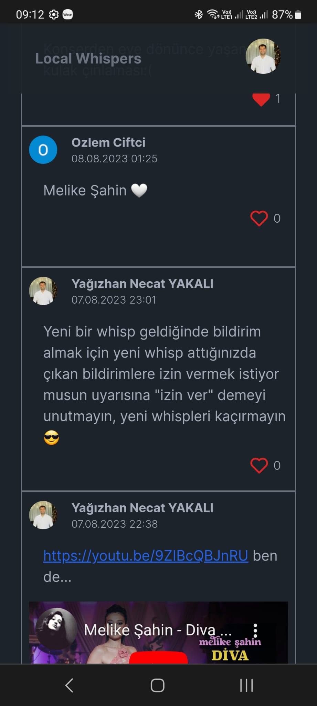

# Local Whispers: A Mini Social Media Platform for Sharing Whisps Locally

Local Whispers is a unique mini social media platform designed to facilitate the sharing of Whisps – text-based messages, YouTube links, and images – with local friends and community members. This project is developed using Next.js, Tailwind CSS, and Prisma, offering an engaging and personalized user experience.

## Key Features

- **Whisp Sharing:** Share text-based Whisps, YouTube links, and images to communicate your thoughts, ideas, and favorite media.
- **Whisp Interactions:** Users can like Whisps to show appreciation and engage with the community.
- **Google Authentication:** Users can seamlessly log in using their Google accounts for a streamlined experience.

## Technologies Used

- **Frontend:** Developed using Next.js for server-side rendering and efficient routing.
- **UI Styling:** Tailwind CSS is utilized to create stylish and responsive user interfaces.
- **Backend:** Powered by Node.js and Express, ensuring scalability and performance.
- **Database:** Prisma manages the relational database, storing Whisps, user data, and interactions.
- **Authentication and Security:** Google OAuth2 integration with NextAuth and JWT tokens for secure user authentication.

## Getting Started

1. Clone the repository: `git clone https://github.com/yagizhanNY/local-whispers.git`
2. Navigate to the project folder: `cd local-whispers`
3. Install dependencies: `npm install`
4. Configure environment variables in `.env` (refer to `.env.example`).
5. Set up the Prisma database: `npx prisma migrate dev`
6. Start the development server: `npm run dev`
7. Open your browser and visit: `http://localhost:3000`

## Contributing

Local Whispers welcomes contributions from the open-source community. To contribute:

1. Fork the repository.
2. Create a new branch for your feature: `git checkout -b feature-name`
3. Implement changes and commit: `git commit -m "Add new feature"`
4. Push changes to your fork: `git push origin feature-name`
5. Create a pull request describing your changes.

## License

This project is licensed under the [MIT License](LICENSE).

---

Join us in shaping the future of local social interactions through sharing Whisps! Contribute, provide feedback, or report issues to help improve the platform.

# Still Under the Development
